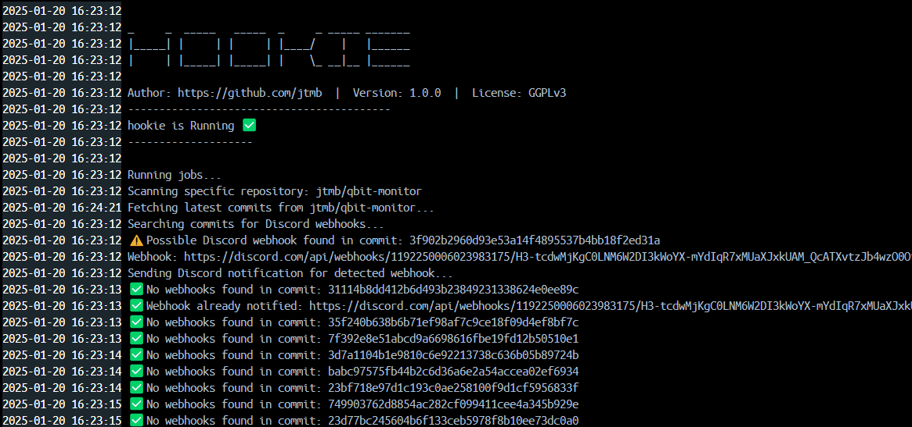
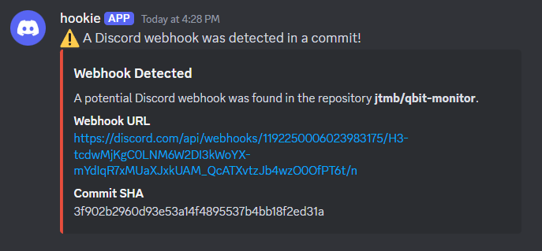

<h1 align="center">
  <a href="https://github.com/jtmb">
    
  </a>
</h1>

<div align="center">
  <b>hookie</b> - Scan repositories for any potentialy leaked Discord webhooks.
  <br />
  <br />
  <a href="https://github.com/jtmb/hookie/issues/new?assignees=&labels=bug&title=bug%3A+">Report a Bug</a>
  ·
  <a href="https://github.com/jtmb/hookie/issues/new?assignees=&labels=enhancement&template=02_FEATURE_REQUEST.md&title=feat%3A+">Request a Feature</a>
  .
  <a href="https://hub.docker.com/repository/docker/jtmb92/hookie/general">Docker Hub</a>
</div>
<br>
<details open="open">
<summary>Table of Contents</summary>

- [About](#about)
- [Prerequisites](#prerequisites)
- [Getting Started](#getting-started)
    - [Docker Image](#docker-image)
    - [Running on Docker Compose](#running-on-docker-compose)
    - [Running without docker](#running-without-docker)
- [Environment Variables Explained](#environment-variables-explained)
- [Contributing](#contributing)
- [License](#license)

</details>
<br>

---

### <h1>About ( What problem does this solve? )</h1>

Designed with auditing in mind, hookie scans repositories for any potential Discord webhooks. It can scan specific repositories, random repositories, or all repositories from a specific GitHub user. When a potential Discord webhook is found in a commit, it will send a notification to a specified Discord webhook.

---

### Features:
- Scan random repositories from GitHub
- Scan specific repositories
- Scan all repositories of a specific GitHub user
- Detect potential Discord webhooks in commit files
- Send notifications to a Discord webhook when a webhook is detected


<details>
  <summary>View Screenshots</summary>
  <div style="display: flex; gap: 10px; margin-top: 10px;">
    
    
    
  </div>
</details>


## Prerequisites

- **GitHub Personal Access Token (PAT)**: Used to authenticate with GitHub's API to access repository data.
- **Notification Webhook URL**: A Discord webhook URL where notifications will be sent when a webhook is detected.

### <h2>Getting Started</h2>
### [Docker Image](https://hub.docker.com/r/jtmb92/hookie)
```docker
 docker pull jtmb92/hookie
```

> <span style="color:yellow;"> **Note:**</span> This container does not run as `root`. To ensure proper functionality, you must take ownership of the required directories on your host system and set the correct permissions before starting the container. For example:

```bash
username=$(whoami)
sudo chown $username:$username /mnt/hookie
sudo chmod 755 /mnt/hookie
```

### Running on Docker Compose  
Run on Docker Compose (this is the recommended way) by running the command "docker compose up -d".  
```yaml
services:
  hookie:
    image: docker.io/jtmb92/hookie
    container_name: hookie
    environment:
      GITHUB_TOKEN: "your-github-token" #GitHub Personal Access Token (PAT) - Ensure you store this securely
      DISCORD_WEBHOOK_PATTERN: "https://discord.com/api/webhooks"
      NOTIFICATION_WEBHOOK: "your-discord-webhook" # Replace with your notification webhook URL
      NOTIFIED_WEBHOOKS_FILE: "/app/state/notified_webhooks.txt"
      PUID: "1000"
      PGID: "1000"
    volumes:
      - /mnt/hookie:/app/state
    command: "--random" # Replace with the desired option, e.g., --user <username> or <owner/repo]

```

## Environment Variables Explained  

- `DISCORD_WEBHOOK_URL: your-discord-token-here`
  - The URL of the Discord webhook used to send notifications.
- `NOTIFIED_WEBHOOKS_FILE: /app/state/notified_webhooks.txt`
  - Path to the file that keeps track of the webhooks already notified.
- `GITHUB_TOKEN: your-github-token-here`
  - The GitHub Personal Access Token (PAT) used to authenticate API requests.
- `NOTIFICATION_WEBHOOK: your-discord-webhook`
  - The webhook URL used for sending notifications to Discord.
- `PUID: "1000"`
  - User ID for setting appropriate user permissions.
- `PGID: "1000"`
  - Group ID for setting appropriate group permissions.


## Volumes Explained  

- `/mnt/hookie:/app/state`
  - Maps the host directory `/mnt/hookie` to the container directory `/app/state`, used for storing state information.


# Running without docker

1. Clone this repository or copy the script to your desired location.
2. Modify the script to add your GitHub Personal Access Token (`GITHUB_TOKEN`), Discord Webhook URL (`NOTIFICATION_WEBHOOK`), and the file where notified webhooks will be saved (`NOTIFIED_WEBHOOKS_FILE`).
3. Install `jq` on your system if you don’t already have it installed.

## Usage

The script accepts several options for scanning repositories:

### 1. Scan Random Repositories

To scan random repositories, use the `--random` option:

```bash
./hookie.sh --random
```

This will fetch a list of random repositories from GitHub and scan them for potential Discord webhooks.

### 2. Scan Specific Repository

To scan a specific repository, provide the `owner/repo` as an argument:

```bash
./hookie.sh <owner/repo>
```

Example:

```bash
./hookie.sh octocat/Hello-World
```

This will scan the specific repository (`octocat/Hello-World`) for any webhooks.

### 3. Scan All Repositories of a Specific GitHub User

To scan all repositories of a specific GitHub user, use the `--user <username>` option:

```bash
./hookie.sh --user <username>
```

Example:

```bash
./hookie.sh --user octocat
```

This will scan all repositories of the user `octocat` for potential webhooks.

### 4. Display Script Usage

If you need help or want to see how to use the script, run it without any arguments or with the `--help` option:

```bash
./hookie.sh
```

or

```bash
./hookie.sh --help
```

This will display the usage instructions.

## Script Flow

1. **Fetching Repositories**:
   - The script fetches repositories either randomly, from a specific user, or from a specific repository based on the argument passed.

2. **Fetching Commits**:
   - For each repository, the script fetches the latest commits and checks them for potential Discord webhooks.

3. **Webhook Detection**:
   - The script searches commit files for potential Discord webhook URLs. If a webhook is detected, it sends a notification to the specified Discord webhook.

4. **Avoiding Duplicate Notifications**:
   - The script tracks which webhooks have been notified by storing them in a file (`NOTIFIED_WEBHOOKS_FILE`). If a webhook is found again, it will not send a duplicate notification.

## Script Arguments

| Argument                | Description                                                           |
|-------------------------|-----------------------------------------------------------------------|
| `--random`              | Scan random repositories from GitHub.                                 |
| `<owner/repo>`          | Scan a specific repository (e.g., `octocat/Hello-World`).             |
| `--user <username>`     | Scan all repositories of the specified GitHub user.                  |
| `--help`                | Display usage instructions for the script.                            |

## Example Commands

- Scan random repositories:
  ```bash
  ./hookie.sh --random
  ```

- Scan a specific repository:
  ```bash
  ./hookie.sh octocat/Hello-World
  ```

- Scan all repositories of a user:
  ```bash
  ./hookie.sh --user octocat
  ```

- Get help:
  ```bash
  ./hookie.sh --help
  ```

## Contributing

First off, thanks for taking the time to contribute! Contributions are what makes the open-source community such an amazing place to learn, inspire, and create. Any contributions you make will benefit everybody else and are **greatly appreciated**.

Please try to create bug reports that are:

- _Reproducible._ Include steps to reproduce the problem.
- _Specific._ Include as much detail as possible: which version, what environment, etc.
- _Unique._ Do not duplicate existing opened issues.
- _Scoped to a Single Bug._ One bug per report.

## License

This project is licensed under the **GNU GENERAL PUBLIC LICENSE v3**. Feel free to edit and distribute this template as you like.

See [LICENSE](LICENSE) for more information.